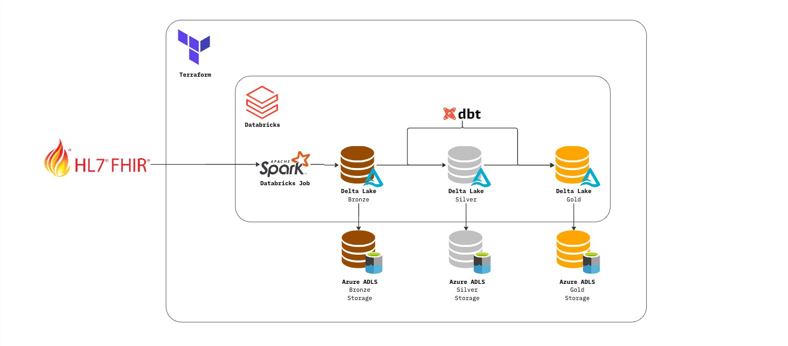

# Azure Databricks Data Lake PoC



## About

A simple proof of concept data pipeline utilising Azure Databricks and Azure Data Lake. Infrastructure is managed using Terraform.

Publicly available HL7 FHIR data is ingested using a Databricks Spark job from the HAPI FHIR server and stored in the bronze layer of the data lake. Ingested data is stored as Delta Lake tables in Azure's ADLS Gen2 storage.

dbt is connected to Databricks SQL Warehouse compute using the `dbt-databricks` adapter. Transformations from bronze to silver and gold layers are performed using dbt.

## Prerequisites

- Python 3.10+

Install CLI tools via [Homebrew](https://brew.sh/):

```bash
brew install azure-cli

brew tap hashicorp/tap
brew install hashicorp/tap/terraform

brew tap databricks/tap
brew install databricks
```

Install Python dependencies and activate the virtual environment:

```bash
poetry install
source $(poetry env info --path)/bin/activate
```

## Deployment

1. Authenticate to Azure and select your subscription:
   ```bash
   az login
   ```
2. Copy `terraform/terraform_example.tfvars` to `terraform/terraform.tfvars` and set your `subscription_id`.
3. Initialise the remote backend for Terraform state:
   ```bash
   bash terraform/tf_backend_setup.sh
   ```
4. Deploy the infrastructure:
   ```bash
   cd terraform
   terraform init
   terraform plan   # review the changes
   terraform apply  # provision resources
   ```

Terraform will output a `databricks_workspace_url` — open it and sign in with your Microsoft account. You should see the Unity Catalog with **bronze**, **silver**, and **gold** schemas in the left-hand nav.

> **Tip:** Update the resource group and storage account names in `terraform.tfvars` to something unique to avoid naming conflicts.

## Teardown

```bash
cd terraform && terraform destroy
```